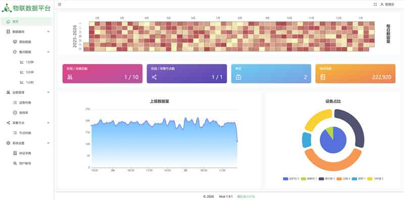
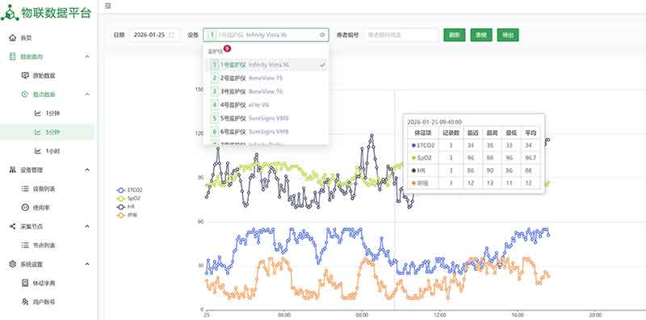

# Hiot Patient Vital Signs Data Acquisition System

[简体中文](./README.md) | English

## Overview

The system is designed to acquire patients’ vital signs data (excluding waveforms and alarms) from various hospital monitoring devices such as anesthesia machines and patient monitors. It also provides query services for third-party application systems to access the collected vital signs data.

## Features

- **Extensive Device Compatibility**: Supports commonly used medical devices from Philips, Dräger, Mindray, Biolight, Comen, Edan, GE Healthcare, Ohmeda, and more. Additional device models can be integrated as needed.
- **Flexible Deployment Options**: Supports both centralized and distributed deployment modes. Distributed nodes can temporarily store data during network outages and automatically resume transmission when the network is restored. The system can be deployed on data acquisition boxes or industrial computers to accommodate different application scenarios.
- **Multi-Platform Support**: Compatible with major operating systems such as Windows and Linux, and can be registered as a system service to enable automatic startup on boot.
- **Multiple Connectivity Methods**: Supports direct device connections or data acquisition across switches and routers. Devices without network ports can also be connected via serial ports or USB.
- **Customizable Data Acquisition**: Users can configure which vital signs items to collect, and the system supports mapping device-specific codes to third-party application system codes.
- **Data Aggregation and Analytics**: In addition to raw data retrieval, the system can output aggregated data at regular intervals (e.g., 1 minute, 5 minutes, 1 hour) and provide multi-dimensional metrics such as maximum, minimum, and average values within a given time range.
- **Visualized Operations Dashboard**: Comes with a user-friendly visual interface for operations and maintenance teams to monitor real-time device data and connection status.
- **High Performance and Stability**: Proven in numerous real-world deployments, the system achieves high data throughput with low resource consumption. A single-core CPU and 1 GB RAM can support data acquisition for hundreds of devices simultaneously.

## Screenshots

Device Status

---

5-minute Data Aggregation

---

Data platform

---

Data platform

## Contact Us

For more information or project collaboration, please contact us at:

Email: yusoo@qq.com

## Links

[VitalSignsAcquisitionSystem](https://yusoo.github.io/VitalSignsAcquisitionSystem/)

[HL7](https://www.hl7.org)
